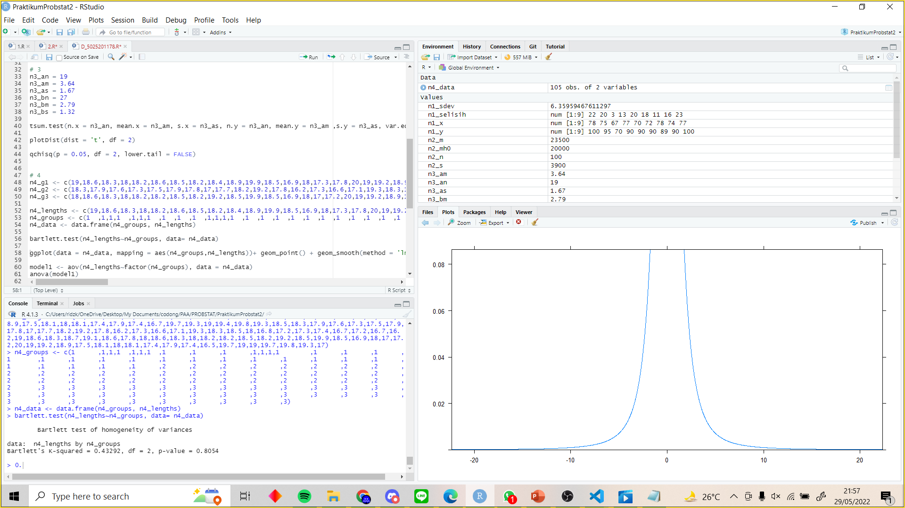
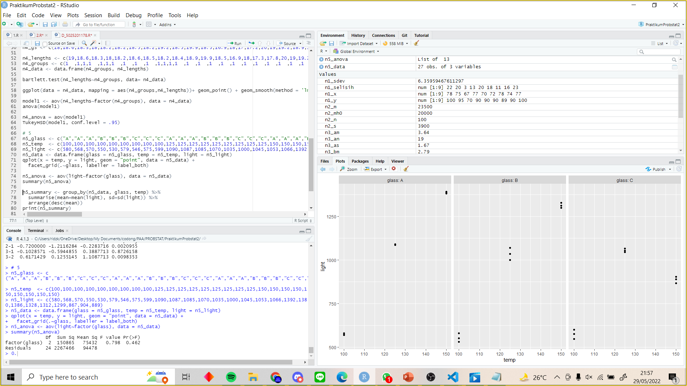

# Praktikum Probstat 2
Nama: Ridzki Raihan Alfaza  
NRP: 5025201178  
Kelas: Probstat D  
## No 1
### a
```r
n1_sdev = sd(n1_selisih, na.rm = FALSE)
n1_sdev
```
mencari standar deviasi dengan `sd`


### b
```r
t.test(n1_x,n1_y, paired = TRUE)
```
cari nilai t dan p-value


## No 2
```r
n2_mh0 = 20000
n2_n = 100
n2_m = 23500
n2_s = 3900
tsum.test(mean.x = n2_m, s.x = n2_s ,n.x = n2_n, mu = n2_mh0, alternative = "greater", var.equal =  TRUE)
```


# a
karena 95 percent confidence level berada pada interval 22852.45 sampai infinit maka mean asli diatas 20000
# b
output yang dihasilkan menunjukkan nilai t = 8.9744, derajat kebebasan 99, dan p-value 9.437e-15, selain itu output menunjukkan bahwa interval confidence 95% diatas x = 22852.45
# c
Karena p value dari tsum test lebih besar, maka kesimpulan yang diambil adalah mean asli lebih besar dari pada 20000
# 3
## a
H0 : mean.bali = mean.bandung  
H1 : mean.bali != mean.bandung  
## b
```r
tsum.test(n.x = n3_an, mean.x = n3_am, s.x = n3_as, n.y = n3_an, mean.y = n3_am ,s.y = n3_as, var.equal = TRUE, alternative = "greater")
2*pnorm(-abs((n2_m - n2_mh0)/(n2_s/sqrt(n2_n)))) # p value from z score
```
menghitung mean sampel dan p-value  


## c
```r
plotDist(dist = 't', df = 2)
```
plot t distribution dengan df = 2


## d
```r
qchisq(p = 0.05, df = 2, lower.tail = FALSE)
```
mendapat nilai kritis dengan `qchisq`


## ef
karena nilai dari titik kritis lebih besar daripada p-score pada `tsum.test` maka bisa tolak hipotesis bahwa kedua bandung dan bali memiliki mempunyai mean yang sama
# 4
## a
```r
n4_g1 <- c(19,18.6,18.3,18,18.2,18.6,18.5,18.2,18.4,18.9,19.9,18.5,16.9,18,17.3,17.8,20,19,19.2,18.9,17.5,18.1,18,18.1,17.4,17.9,17.4,16.7,19.7,19.3,19,19.4,19.8,19.3,18.5)
n4_g2 <- c(18.3,17.9,17.6,17.3,17.5,17.9,17.8,17,17.7,18.2,19.2,17.8,16.2,17.3,16.6,17.1,19.3,18.3,18.5,18,16.8,17.2,17.3,17.4,16.7,17.2,16.7,16.2,19,18.6,18.3,18.7,19.1,18.6,17.8)
n4_g3 <- c(18,18.6,18.3,18,18.2,18.2,18.5,18.2,19.2,18.5,19.9,18.5,16.9,18,17,17.2,20,19,19.2,18.9,17.5,18.1,18,18.1,17.4,17.9,17.4,16.5,19.7,19,19,19.7,19.8,19.3,17)
```
## b
```r
n4_lengths <- c(19,18.6,18.3,18,18.2,18.6,18.5,18.2,18.4,18.9,19.9,18.5,16.9,18,17.3,17.8,20,19,19.2,18.9,17.5,18.1,18,18.1,17.4,17.9,17.4,16.7,19.7,19.3,19,19.4,19.8,19.3,18.5,18.3,17.9,17.6,17.3,17.5,17.9,17.8,17,17.7,18.2,19.2,17.8,16.2,17.3,16.6,17.1,19.3,18.3,18.5,18,16.8,17.2,17.3,17.4,16.7,17.2,16.7,16.2,19,18.6,18.3,18.7,19.1,18.6,17.8,18,18.6,18.3,18,18.2,18.2,18.5,18.2,19.2,18.5,19.9,18.5,16.9,18,17,17.2,20,19,19.2,18.9,17.5,18.1,18,18.1,17.4,17.9,17.4,16.5,19.7,19,19,19.7,19.8,19.3,17)
n4_groups <- c(1	,1,1,1	,1,1,1	,1	,1	,1	,1,1,1,1	,1	,1	,1	,1	,1	,1	,1	,1	,1	,1	,1	,1	,1	,1	,1	,1	,1	,1	,1	,1	,1	,2	,2	,2	,2	,2	,2	,2	,2	,2	,2	,2	,2	,2	,2	,2	,2	,2	,2	,2	,2	,2	,2	,2	,2	,2	,2	,2	,2	,2	,2	,2	,2	,2	,2	,2	,3	,3	,3	,3	,3	,3	,3	,3	,3	,3	,3	,3	,3	,3	,3	,3	,3	,3	,3	,3	,3	,3	,3	,3	,3	,3	,3	,3	,3	,3	,3	,3	,3	,3	,3)
n4_data <- data.frame(n4_groups, n4_lengths)

bartlett.test(n4_lengths~n4_groups, data= n4_data)
```
mencari homogenity of variances memakai bartlett test


## ce
```r
ggplot(data = n4_data, mapping = aes(n4_groups,n4_lengths))+ geom_point() + geom_smooth(method = 'lm')

model1 <- aov(n4_lengths~factor(n4_groups), data = n4_data)
anova(model1)
```
uji anova


## d
```r
n4_anova = aov(model1)
TukeyHSD(model1, conf.level = .95)
```
dari hasil tersebut didapatkan bahwa terdapat perbedaan panjang signifikan di antara grup 1 dengan grup 3


# 5
## a
```r
n5_glass <- c("A","A","A","B","B","B","C","C","C","A","A","A","B","B","B","C","C","C","A","A","A","B","B","B","C","C","C")
n5_temp  <- c(100,100,100,100,100,100,100,100,100,125,125,125,125,125,125,125,125,125,150,150,150,150,150,150,150,150,150)
n5_light <- c(580,568,570,550,530,579,546,575,599,1090,1087,1085,1070,1035,1000,1045,1053,1066,1392,1380,1386,1328,1312,1299,867,904,889)
n5_data <- data.frame(glass = n5_glass, temp = n5_temp, light = n5_light)
qplot(x = temp, y = light, geom = "point", data = n5_data) +
  facet_grid(.~glass, labeller = label_both)
```
visualisasi data


## b
```r
n5_anova <- aov(light~factor(glass), data = n5_data)
summary(n5_anova)
```
uji anova


## c
```r
n5_summary <- group_by(n5_data, glass, temp) %>%
  summarise(mean=mean(light), sd=sd(light)) %>%
  arrange(desc(mean))
print(n5_summary)
```


## d
```r
n5_tukey <- TukeyHSD(n5_anova)
n5_tukey
```
uji tukey


## e
```r
n5_cld <- multcompLetters4(n5_anova, n5_tukey)
n5_cld
```
untuk membual cld membandingkan 2 objek, memakai `multcompLetters4`

